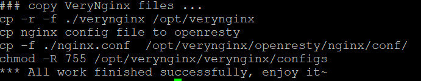
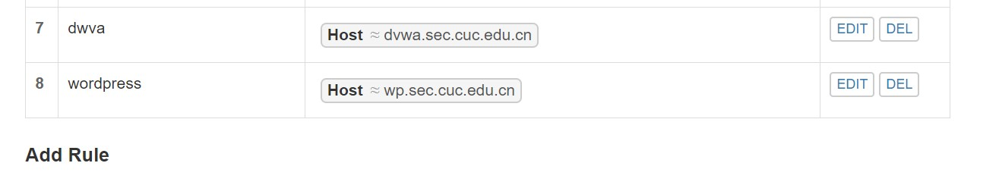
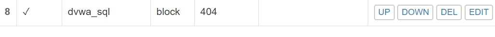

## 第五章实验报告——web服务器

### 实验环境
- Ubuntu 18.04.4
- puTTy
- Wordpress 4.7
- Nginx
- VeryNginx
- dvwa

### 实验步骤
- 安装Nginx
  ```sudo apt-get install nginx```

- 安装VeryNginx
    + 下载镜像``` git clone https://github.com/alexazhou/VeryNginx.git ```
    + 安装python ```sudo apt-get install python```
    + 安装libpcre3库 ```sudo apt-get install libpcre3 libpcre3-dev```
    + 安装libssl库 ```sudo apt-get install libssl-dev libssl-dev```
    + 安装zlib ```sudo apt-get install zlib1g-dev```
    + ```sudo python install.py install```
    

- VeryNginx 配置
    + ```sudo vim /opt/verynginx/openresty/nginx/conf/nginx.conf```
        * ```user www-data```
        * ```server {listen 192.168.56.102:8080```

    + 启动verynginx 
    ```sudo /opt/verynginx/openresty/nginx/sbin/nginx```
    

    --- 

- 安装wordpress
    + 安装mysql
    ```sudo apt-get install mysql-server```
    + 用mysql创建数据库
    ```
    mysql -u root -p
    CREATE DATABASE wordpress DEFAULT CHARACTER SET utf8 COLLATE utf8_unicode_ci;
    GRANT ALL ON wordpress.* TO 'wordpressuser'@'localhost' IDENTIFIED BY 'password';
    FLUSH PRIVILEGES; 
    exit;
    ```
    + 安装php
    ```
    apt-get install php-curl php-gd php-intl php-mbstring php-soap php-xml php-xmlrpc php-zip
    apt-get install php-mysql php-fpm
    systemctl restart php7.2-fpm
    ```

    + 修改nginx的配置文件
    ```
    sudo vi /etc/nginx/sites-available/default
    ```
    + 配置证书
    ```
    sudo openssl req -x509 -nodes -days 365 -newkey rsa:2048 -keyout /etc/ssl/private/nginx-selfsigned.key -out /etc/ssl/certs/nginx-selfsigned.crt
    ```
    
    ```
    创建self-signed.conf
    sudo vi /etc/nginx/snippets/self-signed.conf

    内容
    ssl_certificate /etc/ssl/certs/nginx-selfsigned.crt;
    ssl_certificate_key /etc/ssl/private/nginx-selfsigned.key;
    ```


    + 下载并配置wordpress4.7
    ```
    mkdir ~/tmp && cd ~/tmp
    wget https://github.com/WordPress/WordPress/archive/4.7.zip
    7z x 4.7.zip
    cp wordpress/wp-config-sample.php wordpress/wp-config.php
    cp -a wordpress/. /var/www/html/wordpress
    chown -R www-data:www-data /var/www/html/wordpress
    vim /var/www/html/wordpress/wp-config.php
    ```

    + 打开网页，成功登陆WordPress界面
    

    ---

- 安装dvwa
    + 下载并移动dvwa文件
    ```
    mkdir /var/www/html/DVWA
    git clone https://github.com/ethicalhack3r/DVWA /tmp/DVWA
    rsync -avP /tmp/DVWA/ /var/www/html/DVWA
    ```

    + dvwa配置
    ```
    #复制config.inc.php.dist到config.inc.php
    cp /var/www/html/DVWA/config/config.inc.php.dist /var/www/html/DVWA/config/config.inc.php

    #数据库相关操作
    mysql -u root -p
    CREATE DATABASE dvwa DEFAULT CHARACTER SET utf8 COLLATE utf8_unicode_ci;
    GRANT ALL ON dvwa.* TO 'dvwauser'@'localhost' IDENTIFIED BY 'password';
    FLUSH PRIVILEGES;
    exit

    #修改DVWA文件配置
    sudo sudo vim /var/www/html/DVWA/config/config.inc.php
    # $_DVWA[ 'db_user' ] = 'dvwauser'
    ```
    + php配置
    ```
    vim /etc/php/7.2/fpm/php.ini
    #allow_url_include = Off -> On
    #修改DVWA文件访问权限
    chown -R www-data.www-data /var/www/html/
    systemctl restart php7.2-fpm
    
    ```

    + nginx配置
    ```
    vim /etc/nginx/sites-available/default
    systemctl restart nginx
    ```

    + 成功配置dvwa
    

    + 宿主机 Windows 修改 C:\Windows\System32\drivers\etc\hosts

    ```
    192.168.56.102	dvwa.sec.cuc.edu.cn
    192.168.56.102	wp.sec.cuc.edu.cn
    ```

    ---

#### 基本要求
- 在一台主机（虚拟机）上同时配置Nginx和VeryNginx
    
    
- 环境搭建结果
    wordpress 对应 wp.sec.cuc.edu.cn
    dvwa 对应 dvwa.sec.cuc.edu.cn
#### 实验加固
- 使用IP地址方式均无法访问上述任意站点，并向访客展示自定义的友好错误提示信息页面-1
    Matcher
    
    Filter
    

    结果
    
    
    

- DVWA只允许白名单上的访客来源IP，其他来源的IP访问均向访客展示自定义的友好错误提示信息页面-2

    Matcher
    
    Filter
    
    结果
    

- 在不升级Wordpress版本的情况下，通过定制VeryNginx的访问控制策略规则，热修复WordPress < 4.7.1 - Username Enumeration
    Matcher
    
    Filter
    

- 通过配置VeryNginx的Filter规则实现对Damn Vulnerable Web Application (DVWA)的SQL注入实验在低安全等级条件下进行防护
    Matcher
    
    Filter
    

- 通过定制VeryNginx的访问控制策略规则实现： 
    1.限制DVWA站点的单IP访问速率为每秒请求数 < 50
    2.限制Wordpress站点的单IP访问速率为每秒请求数 < 20
    3.超过访问频率限制的请求直接返回自定义错误提示信息页面-4
    4.禁止curl访问
    配置如下：
    
    
    


---

### 参考资料
[How To Install WordPress with LEMP on Ubuntu 18.04](https://www.digitalocean.com/community/tutorials/how-to-install-wordpress-with-lemp-on-ubuntu-18-04)
[How To Create a Self-Signed SSL Certificate for Nginx in Ubuntu 18.04](https://www.digitalocean.com/community/tutorials/how-to-create-a-self-signed-ssl-certificate-for-nginx-in-ubuntu-18-04)
[linux-2019-Jckling](https://github.com/CUCCS/linux-2019-jckling/blob/0x05/0x05/%E5%AE%9E%E9%AA%8C%E6%8A%A5%E5%91%8A.md)