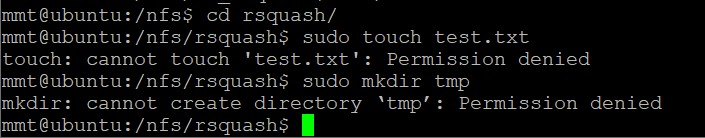

## SHELL脚本编程练习进阶（实验）

FTP、NFS、DHCP、DNS、Samba服务器的自动安装与自动配置

## 实验环境

- unbuntu18.04.4
- puTTy
- 目标主机 192.168.56.104
- 工作主机 192.168.56.102

## 实验要求

- FTP
    + 对照第6章课件中的要求选择一款合适的FTP服务器软件支持所有任务要求
- NFS
    + 对照第6章课件中的NFS服务器配置任务
- DHCP
    + 2台虚拟机使用Internal网络模式连接，其中一台虚拟机上配置DHCP服务，另一台服务器作为DHCP客户端，从该DHCP服务器获取网络地址配置
- Samba
    + 对照第6章课件中smbclient一节的3点任务要求完成Samba服务器配置和客户端配置连接测试

## 实验内容

#### 配置工作主机SSH免密登录

```
目标主机：

#开启ssh服务
sudo service ssh start

#修改ssh配置文件
sudo vim /etc/ssh/sshd_config

#设置可通过口令认证SSH
PasswordAuthentication yes

#设置允许root用户登录
PermitRootLogin yes

#重启ssh服务
sudo systemctl restart ssh

#给root用户设置密码
sudo passwd
```

```
工作主机：

#生成一对公私钥
ssh-keygen -t rsa -P '' -f ~/.ssh/id_rsa

#将公钥传输至目标主机authorized_keys文件
ssh-copy-id -i ~/.ssh/id_rsa root@192.168.56.104

#测试连接
ssh root@192.168.56.104
```


再修改主机的ssh配置设置免密登录
```
sudo vim /etc/ssh/sshd_config
PasswordAuthentication no
PermitRootLogin without-password
```

最终免密登录的命令
```
ssh -i ~/.ssh/id_rsa root@192.168.56.104
```


#### FTP 

- **选用软件**
    + vsftp

- **自动安装配置ftp**
    [vsftpd.sh](script/vsftpd.sh) 
    [vsftpd.conf](configs/vsftpd.conf)

    ```
    #将脚本文件vsftpd.sh拷贝到目标主机
    scp -i .ssh/id_rsa workspace/shell/vsftpd.sh root@192.168.56.104:workspace/

    #ssh执行shell文件
    ssh -i .ssh/id_rsa root@192.168.56.104 'bash workspace/vsftpd.sh'
    ```

- **实验任务**
    1. 配置一个提供匿名访问的FTP服务器，匿名访问者可以访问1个目录且仅拥有该目录及其所有子目录的只读访问权限


    2. 配置一个支持用户名和密码方式访问的账号，该账号继承匿名访问者所有权限，且拥有对另1个独立目录及其子目录完整读写（包括创建目录、修改文件、删除文件等）权限

    + 用户名密码登录+继承匿名者访问权限


    + FTP用户不能越权访问指定目录之外的任意其他目录和文件 无论是匿名用户还是非匿名用户都不能访问其他目录文件


    + 匿名访问权限仅限白名单IP来源用户访问，禁止白名单IP以外的访问


##### FTP遇到的问题

可以用ssh免密登陆目标主机完成匿名访问，但用户名密码连接不了，是在虚拟机直接` sudo su - `继续做的

---

#### NFS

* **自动安装并配置NFS**
    [nfs_srv.sh](script/nfs_svr.sh)
    [nfs_clt.sh](script/nfs_clt.sh)
    [/etc/exports](configs/exports)
    
     ```        
    #将nfs_srv.sh拷贝到目标主机
    scp -i .ssh/id_rsa workspace/shell/nfs_srv.sh root@192.168.56.104:workspace/

    #工作主机运行nfs_srv.sh脚本
    ssh -i .ssh/id_rsa root@192.168.56.104 'bash workspace/nfs_srv.sh'

    #在目标主机通过进程查看nfs服务是否运行
    ps -aux|grep -v grep|grep nfs
    ```

    

    ```
    #工作主机运行nfs_clt.sh脚本
    sudo bash nfs_clt.sh
    (必须sudo)
    ```

    ```
    #不能自动mount目标主机，尝试单独敲命令
    后来发现是配置文件里的工作主机域名写错了
    在目标主机中 `sudo vim /etc/exports `修改
    ```

* **在1台Linux上配置NFS服务，另1台电脑上配置NFS客户端挂载2个权限不同的共享目录，分别对应只读访问和读写访问权限**
    `两个共享文件夹`
    
    
    `可读可写权限演示`
    
    

* **客户端共享目录中文件、子目录的属主、权限信息和在NFS服务器端的信息,uid和gid一致**

    

 * 资料解读NFS目录中的属主和属主组信息
    ```
    By default, NFS translates requests from a root user remotely into a non-privileged user on the server. This was intended assecurity feature to prevent a root account on the client fromusing the file system of the host as root. no_root_squashdisables this behavior for certain shares.
    ```
    * 设置了no_root_squash 访问共享目录时，用户如果是root权限，对共享目录也具有root权限,这种做法增加了服务安全隐患，但此时可以向客户端主机写入文件
    

    * 未设置no_root_squash 访问共享目录时，如root_squash ，如果访问共享目录是root的权限用户，对共享目录的权限会被压缩为nfsnobody用户的权，此时无法向客户端主机写入文件
    

    * 目标主机目录查看
    

---

#### DHCP
* **脚本及配置文件**
    [dhcp.sh](script/dhcp.sh)
    [/etc/dhcp/dhcpd.conf](configs/dhcpd.conf)
    [/etc/default/isc-dhcp-server](configs/isc-dhcp-sever.conf)

* 将两台虚拟机增加网卡,使用Internal网络模式连接
    * DHCP服务器端主机

    

    * DHCP客户端主机

    

* server配置
    ```
    #将脚本dhcp.sh拷贝到目标主机
    scp -i .ssh/id_rsa workspace/shell/dhcp.sh root@192.168.56.104:workspace/

    #运行dhcp.sh脚本
    ssh -i .ssh/id_rsa root@192.168.56.104 'bash workspace/dhcp.sh'
    ```

    - 查看server配置文件
    

 * client配置
    修改配置文件`/etc/netplan/01-netcfg.yaml`，添加enp0s9,设置dhcp4: yes,`sudo netplan apply`使配置生效
    

**实验结果**
- client


- server(失败了！没调试成功QAQ)


---

#### DNS

基于上述Internal网络模式连接的虚拟机实验环境，在DHCP服务器上配置DNS服务，使得另一台作为DNS客户端的主机可以通过该DNS服务器进行DNS查询
在DNS服务器上添加 zone "cuc.edu.cn" 的以下解析记录

- 配置文件
    [/etc/bind/named.conf.options](configs/named.conf)
    [/etc/bind/named.conf.local](configs/named.conf.local)
    [/etc/bind/db.cuc.edu.cn](configs/db.cuc.edu.cn)


##### server
* 安装Bind
    ```
    sudo apt install bind9 bind9utils bind9-doc
    ```
* 修改配置文件
    ``` 
    sudo vim /etc/bind/named.conf.options

    #在options选项中添加以下配置
    listen-on { 192.168.56.102; };  # ns1 private IP address - listen on private network only
    allow-transfer { none; }; # disable zone transfers by default
    forwarders {
    8.8.8.8;
        8.8.4.4;
    };

    sudo vim /etc/bind/named.conf.local

    #添加如下配置
    zone "cuc.edu.cn" {
    type master;
    file "/etc/bind/db.cuc.edu.cn";
    };
    ```

* 生成配置文件`db.cuc.edu.cn`
    `sudo cp /etc/bind/db.local /etc/bind/db.cuc.edu.cn`
* 编辑配置文件
    ```
    sudo vim /etc/bind/db.cuc.edu.cn 
    ```
* 重启bind9
    ```
    sudo service bind9 restart
    ```
##### client

* 安装resolvconf
    ```
    sudo apt update 
    sudo apt install resolvconf
    ```
* 修改配置文件
    ```
    sudo vim /etc/resolvconf/resolv.conf.d/head
    
    #添加配置
    search cuc.edu.cn
    nameserver 192.168.57.1

* 应用resolvconf
    `sudo resolvconf -u`

**测试结果**

(部分未调试出)

---

#### Samba

* 脚本及配置文件
    * [smb_srv.sh](script/smb_srv.sh)
    * [/etc/samba/smb.conf](./configs/)


* `bash smb_srv.sh`

* 在windows 10客户端上连接Linux上的Samba服务器
    * 打开资源管理器，右键“此电脑”，选择“添加一个网络位置",输入共享文件夹路径
    
    
    (创建成功了但打开显示无法连接到192.168.56.102,未解决)
    


* 在Linux上连接Windows10上的服务器
    * 设置共享文件夹
    
    
    * sudo apt-get install smbclient
    * Linux访问Windows的匿名共享目录
    

    * Linux访问Windows的用户名密码方式共享目录
    


## 参考资料

* [linux-2020-cuc-Lynn](https://github.com/CUCCS/linux-2020-cuc-Lynn/blob/chap0x06/chap0x06实验报告.md)
  
* [how-to-set-up-vsftpd-for-a-user-s-directory-on-ubuntu](https://www.digitalocean.com/community/tutorials/how-to-set-up-vsftpd-for-a-user-s-directory-on-ubuntu-16-04)


* [NFS权限配置——no_root_squash](https://blog.51cto.com/12332766/2126316)

* [How to connect to Linux Samba shares from Windows 10](https://www.techrepublic.com/article/how-to-connect-to-linux-samba-shares-from-windows-10/)

* [How to Create Network File Shares with No Passwords in Windows 8](https://www.howtogeek.com/126214/how-to-create-network-file-shares-with-no-passwords-in-windows-8/)
