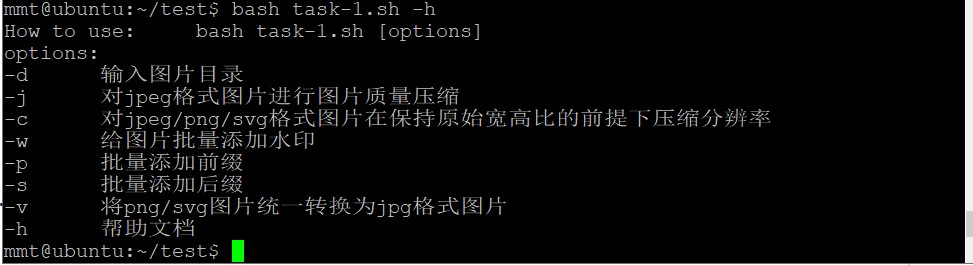
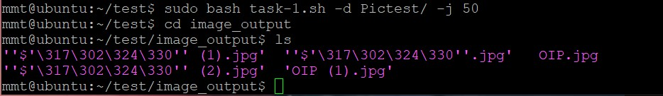
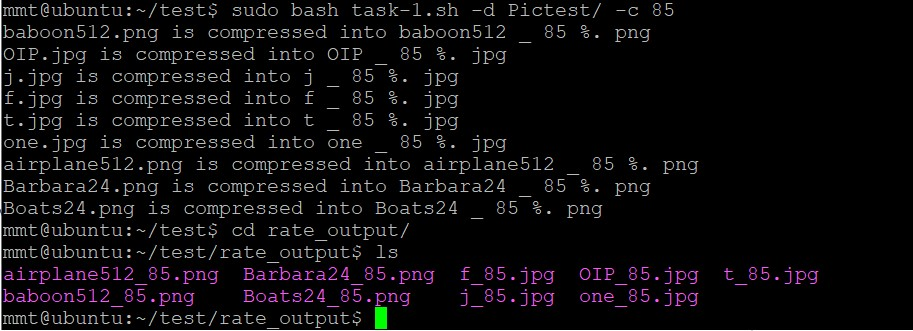
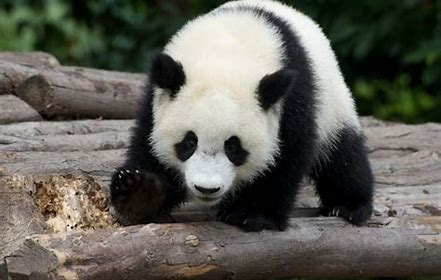
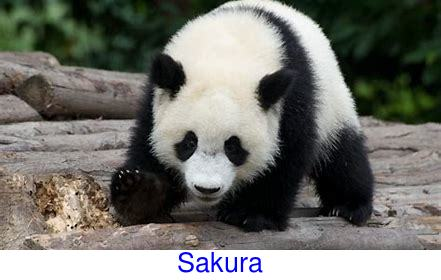
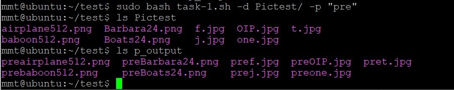
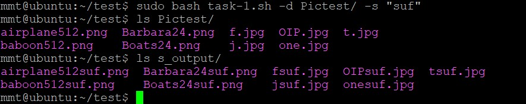
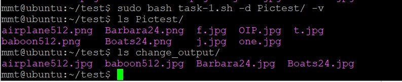
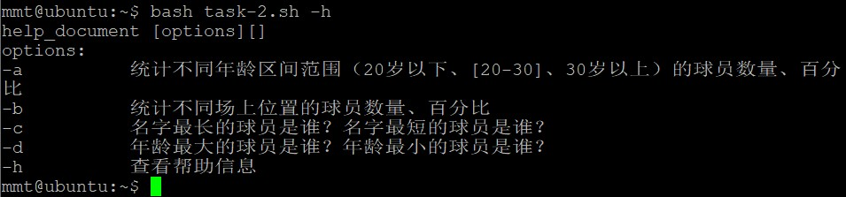
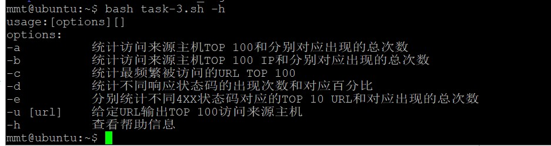

## 第四章：SHELL脚本编程基础（实验）


### 实验环境

- ubuntu-18.04
- PuTTy
- pSFTP


### 实验任务

- [x] 任务一：用bash编写一个图片批处理脚本，实现以下功能：
  - [x] 支持命令行参数方式使用不同功能

  - [x] 支持对指定目录下所有支持格式的图片文件进行批处理

  - [x] 支持以下常见图片批处理功能的单独使用或组合使用

    - [x] 支持对jpeg格式图片进行图片质量压缩

    - [x] 支持对jpeg/png/svg格式图片在保持原始宽高比的前提下压缩分辨率

    - [x] 支持对图片批量添加自定义文本水印

    - [x] 支持批量重命名（统一添加文件名前缀或后缀，不影响原始文件扩展名）

    - [x] 支持将png/svg图片统一转换为jpg格式图片

- [x] 任务二：用bash编写一个文本批处理脚本，对以下附件分别进行批量处理完成相应的数据统计任务：

  - [x] 2014世界杯运动员数据

    - [x] 统计不同年龄区间范围（20岁以下、[20-30]、30岁以上）的球员数量、百分比

    - [x] 统计不同场上位置的球员数量、百分比

    - [x] 名字最长的球员是谁？名字最短的球员是谁？

    - [x] 年龄最大的球员是谁？年龄最小的球员是谁？

  - [x] Web服务器访问日志

    - [x] 统计访问来源主机TOP 100和分别对应出现的总次数

    - [x] 统计访问来源主机TOP 100 IP和分别对应出现的总次数

    - [x] 统计最频繁被访问的URL TOP 100

    - [x] 统计不同响应状态码的出现次数和对应百分比

    - [x] 分别统计不同4XX状态码对应的TOP 10 URL和对应出现的总次数

    - [x] 给定URL输出TOP 100访问来源主机

---

### 实验步骤
- 安装imagemagick工具包
   + sudo apt-get upgrade
   + sudo apt-get install imagemagick-6.q16

## 实验过程
### 任务一 
- 命令行参数方式使用不同功能
  `bash task-1.sh -h`
  

- 支持对JPEG图像进行压缩
  `sudo bash task-1.sh -d Pictest/ -j 50`
  

- 支持对jpeg/png/svg格式图片在保持原始宽高比的前提下压缩分辨率
  `sudo bash task-1.sh -d Pictest/ -c 85`
  


- 支持对图片批量添加自定义文本水印
  `sudo bash task-1.sh -d Pictest/ -w "Sakura"`
  示例如下：
  
  

- 支持批量重命名（统一添加文件名前缀或后缀，不影响原始文件扩展名）
  ```
  sudo bash task-1.sh -d Pictest/ -p "pre"
  sudo bash task-1.sh -d Pictest/ -s "suf"
  ```
  
  
  
  
  
- 支持将png/svg图片统一转换为jpg格式图片
  `sudo bash task-1.sh -d Pictest/ -v`
  


### 任务二
- 帮助文档
  

### 任务三
- 帮助文档
  

---

#### 附录
[juli_Beacon师哥的实验报告](https://github.com/CUCCS/2015-linux-public-JuliBeacon/tree/exp4/%E5%AE%9E%E9%AA%8C%204)

[徐佳慧同学的.travis.yml文件](https://github.com/CUCCS/linux-2020-xjh2811763956/blob/chap0%C3%9704/chap0%C3%9704/.travis.yml)